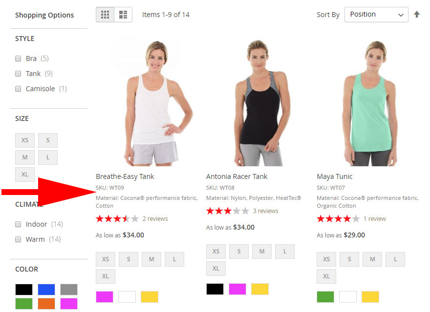
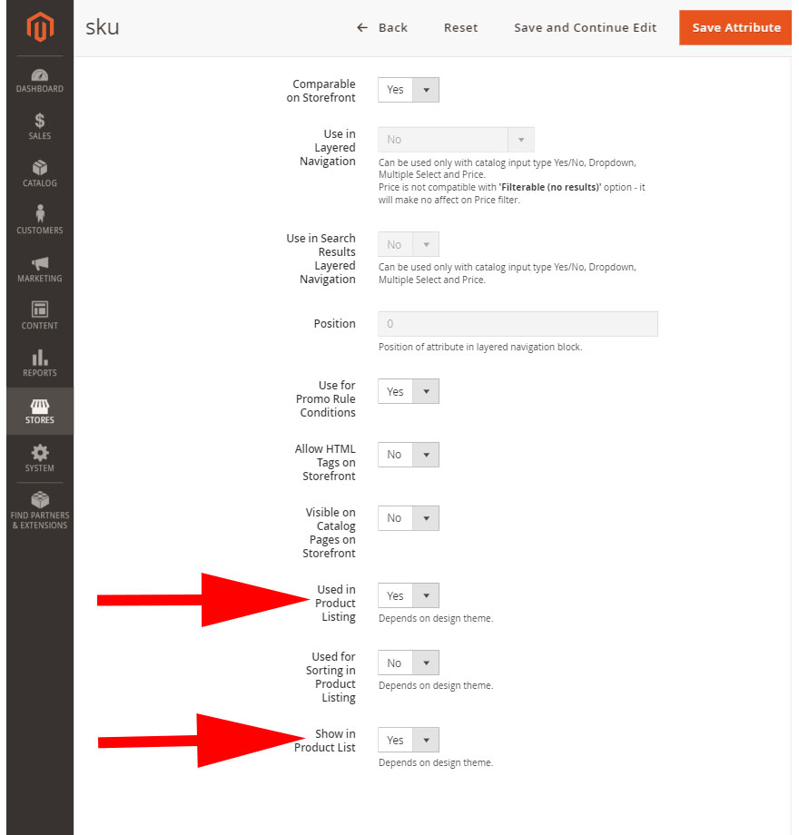

# Модуль для вывода дополнительный атрибутов в списке товаров на странице категории Magento 2.3
Данный модуль поможет показать дополнительные атрибуты в списке товаров, например, артикул, материал, размер и т.д.


## Установка
Скопируйте файлы модуля в папку `app/code/Yu/ProductListDetails`.

Выполните команды в терминале:
```
php bin/magento module:enable Yu_ProductListDetails
php bin/magento setup:upgrade
```

## Настройка
В темплейт списка товаров необходимо вставить код, который будет выводить дополнительные атрибуты

`<?= $block->getChildBlock('product_list_details')->getDetails($_product) ?>`

Как правило это темплейт list.phtml и находится по 

`app/design/frontend/YourTheme/theme/Magento_Catalog/templates/product/list.phtml`

Вставлять лучше между наименованием товара и ценой, в стандартной теме blank, например, это строка 73.

В админке, в настройках атрибута, укажите что его необходимо отображать в списке товаров



### Поддержка
Вопросы, пожелания можно писать на  
email: yuriy.akishin@gmail.com  
skype: yuriy-a76